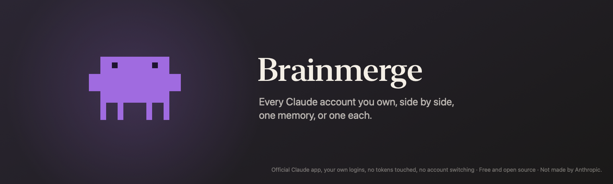
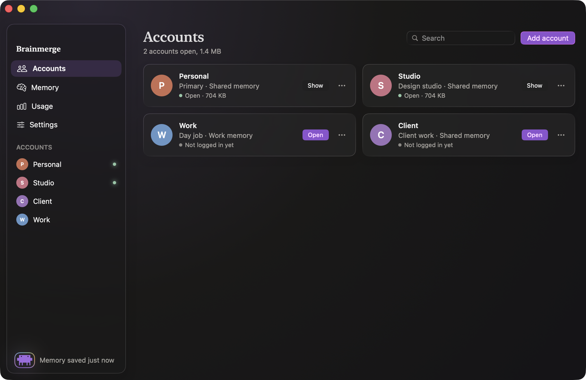
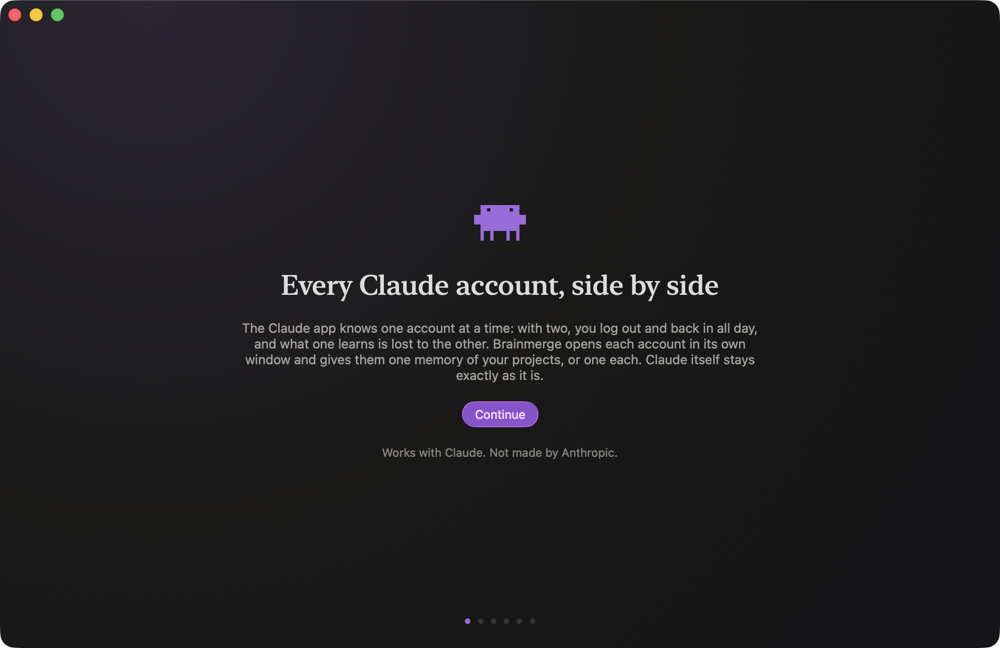
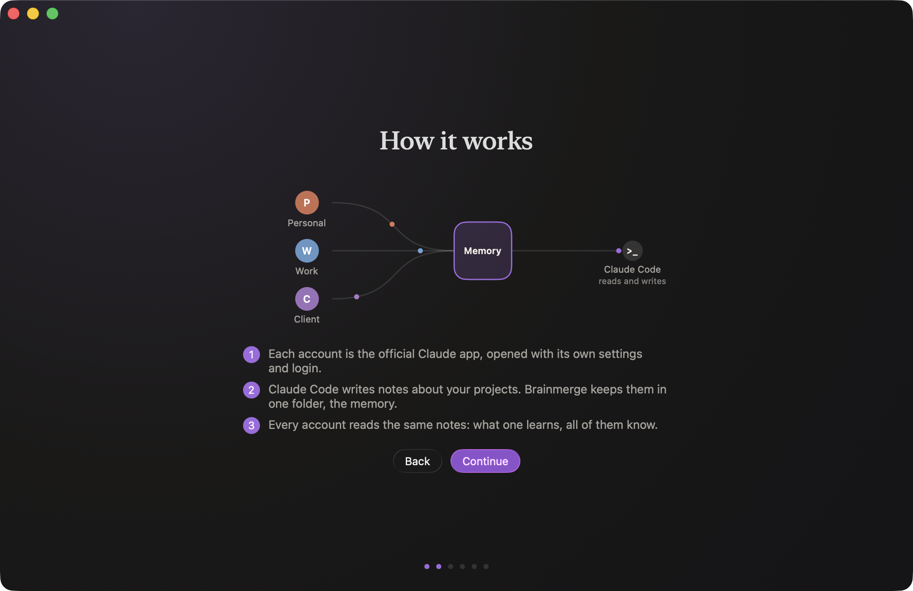
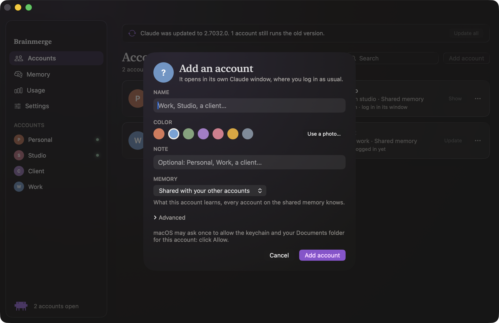
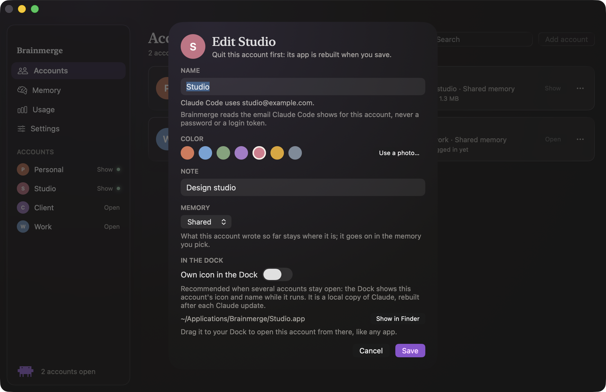
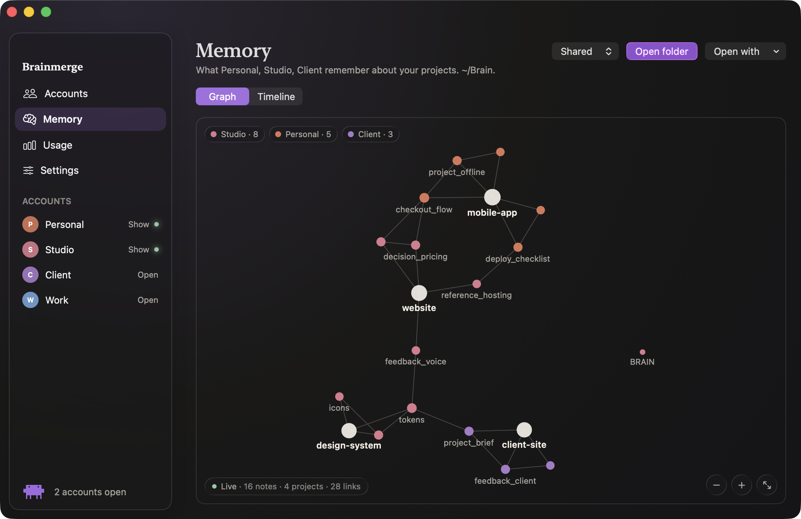
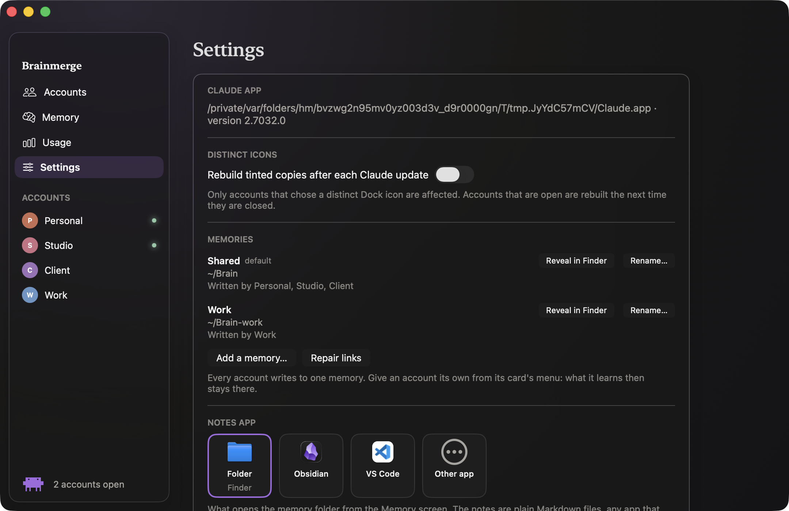
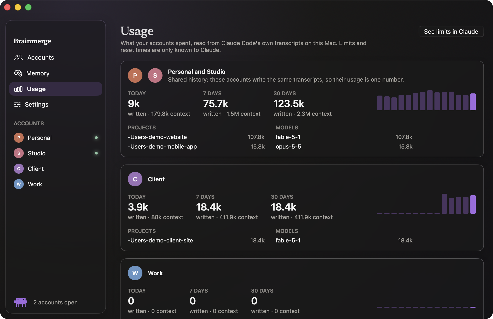

<p align="center">
  
</p>

<p align="center">
  <a href="LICENSE"></a>
  
  
  <a href="https://github.com/ruben4reall/brainmerge/actions/workflows/ci.yml"></a>
</p>

# Brainmerge

**Every Claude account you own, side by side, each with its own window, and one memory between them (or one each).**

[Website](https://brainmerge.vercel.app) · [Download for Mac](https://github.com/ruben4reall/brainmerge/releases/latest/download/Brainmerge.dmg) · [Changelog](CHANGELOG.md)

## The problem

The Claude app knows one account at a time. If you have two, a personal one and one for work, a client's or a team's, you spend the day logging out and back in. Nothing you learned in one account exists in the other. People end up with home-made scripts, duplicated folders and a terminal window they would rather not have.

## What Brainmerge does

Brainmerge is a native macOS app that turns each of your Claude accounts into a real app on your Mac: its own window, its own name, color or photo, its own icon in the Dock if you want. Open it from the Dock or from Brainmerge, log in once, and it stays logged in. All your accounts share one memory of your projects, a folder of plain notes, unless you give an account a memory of its own (work things stay at work). Claude itself stays exactly as it is: the official app, the official Claude Code, your own logins. No terminal, ever: everything is a button.



## Safe for your accounts, by design

Brainmerge is built so that there is nothing in it Anthropic's terms could object to. It only starts the official Claude app and the official Claude Code, each account logs in by itself, and it never reads, stores or sends a password, a token or a cookie. To tell your accounts apart, it only shows the email Claude Code records for each one, and stores it nowhere. It has no account switching, no rotation, no pooled usage, and it makes no network call of its own. Those are not just words: tests scan the source tree at every run to keep them true, and `SECURITY.md` lists exactly what the app touches on your Mac. One account is one person; Brainmerge keeps several of yours tidy, nothing more.

## What you get

- **One app per account.** A personal account and a business one, a client's, a team's: up to fifty. Each has a name, a color or a photo, a note, and an app of its own in `~/Applications/Brainmerge` that you can drag to the Dock. Open, quit, edit, remove, from buttons.
- **One memory, or one each.** What Claude Code learns about a project in one account, the others know too, through a shared folder of Markdown notes (`~/Brain` by default, or a folder you already have: an Obsidian vault works well). Give an account its own memory in one click, for work or a client: what it learns then stays there. Every account writes to exactly one memory; nothing is ever moved or deleted behind your back.
- **A timeline of what was remembered.** Who saved what, about which project, and when, in plain sentences, for each memory.
- **Connected, or not yet.** Each card says whether the account has logged in, and the guided setup turns to "Connected" on its own once you have. Brainmerge only looks at the names of Claude's own storage files, never inside them.
- **Which account is which.** Each card shows the email Claude Code uses for that account, the search finds it, and two accounts on the same Claude account are pointed out. When the names ended up on each other's account, the edit sheet offers to swap them, once you confirm. Claude Code's display name can become the name, never without a click.
- **Alive.** When Claude updates itself, the accounts that keep a copy of it (the ones with their own Dock icon) are rebuilt for the new version, on their own or with one click. Claude's version is checked every few minutes and whenever the window comes to the front.
- **Usage per account.** What each account spent, read from Claude Code's own transcripts on your Mac: today, seven days, thirty days, by project and by model. Informative only: Brainmerge never switches accounts for you. It never reads limits by itself: when you click "Check limits" on an account's card, it asks that account's official Claude Code, the same as typing /usage, and shows what it answers. Reading eight gigabytes of transcripts takes under twenty seconds and a few dozen megabytes; the next read takes under a second.
- **RAM and disk per account.** At the top of the Usage screen: your Mac's RAM counted like Activity Monitor, how much of it each account's Claude uses (with everything it runs), Claude Code sessions in a terminal as one row, the other apps, and the disk space each account's folders and app take. A quiet warning shows when your Mac runs low on RAM.
- **In the menu bar.** The creature sits in the menu bar: open or show any account from there, see your Mac's RAM, open Brainmerge or its settings. With it, closing the window keeps Brainmerge running there; turn it off in Settings and closing the window quits.
- **Nothing leaves your Mac.** No server, no account of ours, no network call from Brainmerge. "Check limits" asks your own Claude Code, which talks to Anthropic as it always does. Everything is local files and git.
- **Leaves cleanly.** Remove Brainmerge from Settings: its hooks, account apps, link and settings go, every project keeps a copy of its notes, your memories and logins stay.

## How it works

### First launch: a guided setup





1. A welcome that says what Brainmerge is for.
2. How it works, with a small animated diagram: several accounts, one memory, Claude Code reading and writing it in every account.
3. Where the memory lives: a new folder, or one you already have. Notes can be written in English or in French. Pick what opens it: the folder, a notes app found on your Mac (Obsidian, Logseq, iA Writer, Typora, VS Code, Cursor, Zed, with their icons), or any other app; free apps are suggested when none is installed.
4. Your current Claude becomes your first account, with every project it already remembers.
5. A second account, optional: name, color, note, and whether it shares the memory or gets its own. It is created on the spot, the screen guides the login (Claude must not be open elsewhere, the login link would land there) and says "Connected" once you are.
6. All set: a live checklist (Claude, memory, accounts, command line), what happens next, and three tips to go further.

### Accounts



Give it a name and a color (or a photo), optionally a note, and pick its memory: shared, another one, or its own. Claude opens in a new window and asks you to log in, like always. The card then shows whether it is open, logged in, and which memory it writes to. Every card has a menu: edit, memory, show its app in Finder, rebuild, quit, remove. In the sidebar and on the cards, each account says what a click does: "Open", or "Show" when its window already runs. Cmd-1 to Cmd-4 switch screens (see the View menu).



Editing an account changes everything in one place: name, color or photo, note, memory, and the "Own icon in the Dock" option. With it, the Dock shows this account's icon and name while it runs (a local tinted copy of Claude, rebuilt after each Claude update); without it, a small launcher starts the real Claude with the right folders. Your first account is the Claude app itself: its name, color, photo and note change while Claude stays open (only a new memory waits for Claude to quit). Brainmerge never changes Claude, so the Dock shows Claude's icon while it runs; the "Own app with this color" switch adds a small app with the account's color or photo that opens Claude, to keep in the Dock in its place. Advanced options when adding: share the conversation history with your first account, or reuse folders you already had for that account.

### The memory



Every account writes its notes into its memory, one subfolder per project. The Memory screen shows it as a live graph, like Obsidian's: every note is a bubble in the color of the account that saved it, links are threads, each project is a larger bubble with its notes around it. A note pulses while Claude Code writes it, and again when the account saves it. Hover a bubble to light its neighbors, click it to read it, double-click it to open it in your notes app. The Timeline tab tells the same story in sentences.

The graph can also show an Obsidian vault, the way Obsidian shows it. Next to the Graph and Timeline switch, pick one of the vaults Obsidian knows, or choose a vault's folder; Brainmerge remembers what you picked. Brainmerge then follows the vault's own graph settings: its search filter and Excluded files, its color groups, orphans, attachments and unresolved links, its forces, sizes and saved zoom, all read again when you change them in Obsidian. Labels fade in as you zoom, hovering a note lights its links and fades the rest, one click opens the note in Obsidian, and a secondary click shows it here. The vault is only read, on your Mac: Brainmerge never writes to it. A vault in Documents, iCloud Drive or another place macOS guards is only read once you pick it, so macOS may ask you then, once, to let Brainmerge read that folder; opening the Memory screen never asks.

A memory is a git repository: each account signs its own saves, so Brainmerge can tell you who remembered what. The graph only reads the folder, never writes to it. Open it in Finder, Obsidian or any app; with several memories, a picker at the top switches between them. Settings lists every memory, the accounts that write to it, and lets you add one, rename one, or forget one you no longer use (its folder stays on disk).

### Settings



Where Claude is, whether Brainmerge shows in the menu bar, whether tinted copies are rebuilt after a Claude update, your memories, the notes app, the language of new notes, the optional command line, a "Star on GitHub" link, and the two exits: check for updates (opens the releases page, no connection from the app) and remove Brainmerge.

### Usage



The screen opens on RAM and disk. First your Mac: the RAM in use (apps, wired and compressed, the way Activity Monitor counts it), out of how much, and the pressure word when macOS says it is short. Then one row per account: the RAM its Claude uses with everything it runs (its windows, its Code tab, the tools they start), as a share of the Mac, and the disk space of its Claude data folder, its Claude Code profile and its app (hover for the parts). A closed account shows its disk only. Claude Code sessions started in a terminal are one row for all accounts together: which account a session uses is only in its environment, which Brainmerge never reads. Disk sizes are added up from file metadata, never file contents, off the main thread, when the screen opens and at most every five minutes ("Measure again" to redo it now); a shared history is counted once, with your first account.

Below, what each account spent: each card is one account, or two accounts that share their history (they write the same transcripts, so their usage is one number). Numbers are output tokens (what Claude wrote) and context (what it read, cache included), from the transcripts Claude Code keeps locally.

Each account with Claude Code has a "Check limits" button on its card, Claude Code only accounts included. Brainmerge never reads limits by itself: on your click, and only then, it runs that account's official Claude Code (`claude -p "/usage"`, the same as typing /usage) and shows each limit it prints as a thin bar with its percentage and reset time, and when it asked. The answer stays in memory until Brainmerge quits; Claude Code itself handles the run like any session it starts, and may keep its own record of it, as when you type /usage. "See limits in Claude" opens Claude's own usage page in your browser.

### Under the hood

- Each account is the official Claude app launched with its own data folder (a standard setting of the app) and Claude Code launched with its own `CLAUDE_CONFIG_DIR` (a variable documented by Anthropic).
- Brainmerge links each project's memory folder into the account's memory, and installs a small Claude Code hook that saves that memory to git at the end of each session.
- The Dock icon of a second account is a small launcher app that starts the real Claude with the right folders. By default nothing else is created. The "own icon" option makes a local copy of Claude on your own Mac, never shared.
- The first account's own app, when you switch it on, is the same small app with its color or photo. It asks macOS to open Claude itself, and only Claude: the one it was built for, signed by Anthropic. Claude opens on its usual folders, or comes to the front if it already runs.
- An app you made yourself for an account, such as a copy of Claude whose executable is a launch script with the account's folders, is recognized by reading its `Info.plist` and that script, never by running it. The edit sheet says which account it opens, and warns, like `brainmerge doctor`, when it runs an older Claude than the one installed, which can damage the account's data. Brainmerge never opens, changes or trashes that app: you retire it yourself once the account is closed.
- "Connected" comes from the presence of Claude's own storage files in the account's data folder. Their contents are never read.
- RAM figures come from the kernel: the Mac's statistics, and one number per Claude process (the footprint Activity Monitor shows), never another process's memory, environment or open files. Disk sizes come from the sizes the file system reports while listing each folder, without following links or opening a file.
- "Check limits" finds Claude Code at absolute paths (`~/.local/bin/claude`, then Homebrew's two), checks with the Security framework that Anthropic signed it and that it is 2.1.275 or later, and runs it with only `HOME`, a minimal `PATH` and the account's `CLAUDE_CONFIG_DIR`, stopped after 20 seconds. Brainmerge reads only the text it prints.
- The email on a card comes from Claude Code's own `.claude.json`, where it records the account it last used for display: only the email, the display name and the organization name are decoded, never the rest. It is shown in the window and written nowhere (not in Brainmerge's state, a memory, a commit or the command line's output).

## Install

1. Download the disk image from the releases page, open it and drag Brainmerge to Applications. If you open the app from somewhere else, it offers to move itself there.
2. Open Brainmerge and follow the guided setup. That is all: no terminal, no configuration file.
3. Add a second account whenever you like. Claude opens in a new window and asks you to log in.

Brainmerge needs macOS 26 and the Claude app. The first time a new account opens, macOS asks once to allow "Claude Safe Storage" in the keychain: click Always Allow. It may also ask whether the new account may access your Documents folder: click Allow. Both prompts come from the Claude app doing exactly what it does on first launch, under the new account's name. Quit your other Claude windows before logging a new account in: the login link from your browser opens in the Claude window that is already running.

Releases are signed with a Developer ID and notarized by Apple: the first time, macOS only asks you to confirm opening an app downloaded from the internet. If you build an unsigned copy yourself, macOS stops its first opening: open System Settings, then Privacy & Security, and click Open Anyway (since macOS 15, right-click and Open no longer does it).

## Why this stays within Anthropic's terms

Anthropic's Consumer Terms forbid sharing or lending accounts, rotating accounts to get around usage limits, and using a subscription token outside Claude Code and the Claude apps. Brainmerge is built to stay on the right side of every one of those rules:

1. It only launches the official Claude app and the official Claude Code that are already installed. Each account logs in by itself, inside them.
2. It never reads, stores or transmits a password, a credential or a token. There is no code path for it. Even "Connected" is decided from file names alone, and the account a card shows is the email and name Claude Code writes down for display, not a credential.
3. It separates accounts with `CLAUDE_CONFIG_DIR`, a variable documented by Anthropic, and with a data folder per instance, a standard setting of the app.
4. The memory is a folder of local files. Brainmerge itself makes no network call, to Anthropic or to anyone else. "Check limits" runs the account's own Claude Code, which does what typing /usage does.
5. It has no account rotation, no switching when a limit is reached, no pooled usage, and never will.
6. It does not redistribute or modify Anthropic's binaries. By default the Claude app is not touched. The optional "own icon" makes a local copy on your own Mac, never shared.

One account is one person. Brainmerge helps people who legitimately hold several accounts, for instance a personal one and one for a business, keep them tidy. It does not promise anything about bans: how you use your accounts is up to you.

## Disclaimer and terms of use

Brainmerge is free and open-source software, published under the MIT license. It is provided "as is", without warranty of any kind. By using it you accept that:

- You are responsible for the Claude accounts you use with it, and for complying with Anthropic's terms of service. Brainmerge does not create, share, rotate or pool accounts, and must not be used to.
- The author is not liable for any suspension of an account, loss of data, or damage arising from the use or misuse of this software. Back up your memory folders; they are git repositories, so you can also push them wherever you like.
- Brainmerge is an independent project. It is not affiliated with, endorsed by, or supported by Anthropic. Claude is a trademark of Anthropic.

If any of this is not acceptable to you, do not use the software.

## Other assistants

The idea is generic: one folder per account, one memory (or several), a hook that saves it. Today the code speaks to the Claude app and Claude Code, because that is what the author uses every day. Codex and other assistants with a desktop app have similar levers (Codex CLI honors `CODEX_HOME`, reads `AGENTS.md`, and can run a command on events), but not the same automatic memory, so support is on the roadmap rather than promised. If you want to bring your assistant, open an issue: the account and memory models are designed to take a second provider.

## Command line

For people who like one. The app links `brainmerge` into `~/.local/bin` at the end of the first launch (Settings, Command line, to reinstall). Everything the app does is available there:

```
brainmerge brain init [path] [--lang en|fr]     create the default memory
brainmerge brain list | add --name NAME [path] | forget ID | rename ID --name NAME
brainmerge brain status | wire | timeline [--brain ID]
brainmerge adopt-primary [--name NAME]          your current Claude becomes the first account
brainmerge identity list [--json]
brainmerge identity add --name NAME [--tint COLOR] [--logo FILE] [--note TEXT]
                        [--brain ID | --own-brain] [--no-desktop] [--tinted-icon]
                        [--shared-history] [--adopt-cli DIR] [--adopt-desktop DIR]
brainmerge identity edit SLUG [--name] [--tint] [--logo] [--note] [--brain ID] [--icon distinct|launcher] [--own-app on|off]
brainmerge identity remove SLUG [--delete-data]
brainmerge identity launch | quit | rebuild SLUG
brainmerge usage [--identity SLUG] [--json] [--timing]
brainmerge sync --identity SLUG                 save the memory (called by a Claude Code hook)
brainmerge doctor [--json]                      check that everything is in place
brainmerge uninstall [--yes]                    undo everything, keep every note and login
```

## Contributing

Issues and pull requests are welcome: see `CONTRIBUTING.md` for the workflow and the rules, `docs/brand/DESIGN.md` for the design tokens. The code is Swift: `Packages/BrainmergeCore` (engine and command line), `Packages/BrainmergeUI` (SwiftUI screens and models), and an Xcode project generated with `xcodegen generate`. Please keep the six points above true.

## License

MIT. See `LICENSE`.

Works with Claude. Not made by Anthropic.
